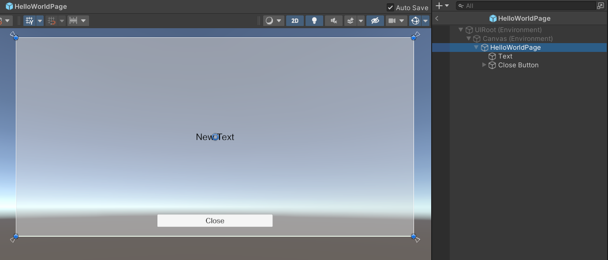

# VentiCola UI

一个基于 Unity 和 Universal RP 的 UI 框架，支持 MVC、MVVM 等多种写法，支持 UI 背景模糊。

已验证的 Unity 版本：`2021.3 LTS Windows`。

## 导入

打开 Package Manager，点击左上角加号，选择 Add package from git URL...，输入 https://github.com/Jin-Yuhan/com.venticola.ui.git 后点击 Add。

## 配置

（之后有空再配图，现在凌晨三点，困死了...

打开 Project Settings，选择 VentiCola UI，点击 Create Runtime Settings 按钮，创建运行时设置。

创建一个 UIRoot 预制体，并赋值给运行时设置上的 UIRoot 上。该预制体需要包含一个 Screen-Space Camera 类型的 Canvas、一个 UICamera 和一个 EventSystem。可以模仿包目录下的 `Prefabs/UI Root` 来制作。UICamera 的 RenderType 必须是 Overlay，一些没必要开启的渲染选项都可以关闭。

为 UICamera 创建一个新的 Universal Renderer。将 Filtering 中的两个 LayerMask 都设置为 `Nothing`。关闭后处理、阴影等没用的选项。添加名为 Advanced UI Renderer 的 Renderer Feature。新建一个 Layer，起名叫 `Hidden UI`（或者其他 as you like），然后赋值给 Advanced UI Renderer 中的 `Hidden UI Layer` 字段。

UICamera 的 Culling Mask 设置为 `UI` 和 `Hidden UI` 两层。

为 MainCamera 创建一个新的 Universal Renderer。关闭所有能关闭的选项，让它什么都不干。

将两个 Universal Renderer 都加到 Universal Render Pipeline Asset 的 Renderer List 中。

将 UICamera 的 Renderer 设置为你创建的第一个 Renderer。

在运行时设置中，将 Main Camera Renderers 下的 `Light Weight` 设置为你创建的第二个 Renderer。

## 基本使用

### UIManager

框架在 `VentiCola.UI` 命名空间下提供了 `BaseUIManager` 这个抽象类，你需要继承它，实现一个为当前项目定制的 UIManager。下面是两个必须实现的方法（一般情况下，实现这两个方法就够了）：

``` c#
// 对接资源管理系统，用于加载 UI 预制体
// 在加载完成后调用 callback，传入的参数分别为 key 和加载出的 prefab。如果 prefab 为 null 则视为加载失败
protected abstract void LoadPrefabAsync(string key, Action<string, GameObject> callback);

// 对接资源管理系统，用于释放 UI 预制体
protected abstract void ReleasePrefab(string key, GameObject prefab);
```

在 `VentiCola.UI.Specialized` 命名空间下，有一些 `BaseUIManager` 的特殊实现，你可以直接使用它们，也可以让自己的 UIManager 从它们派生。

- `ResourcesUIManager`：基于 Resources 的 UIManager。
- `AddressablesUIManager`：基于 Addressables 的 UIManager，需要项目导入 Addressables，否则没有该类。

### 单例模式

你可以使用 `VentiCola.UI.Singleton<T>` 来快速实现线程安全的单例模式。例如：

``` c#
using VentiCola.UI;

// ...

public class UIManager : VentiCola.UI.Specialized.ResourcesUIManager { }

// ...

// 使用单例来调用
Singleton<UIManager>.Instance.DoSomething();
```

### UI 页面

一个 UI 页面由三部分组成：

- 预制体：即 Prefab，保存了页面的布局、元素等信息。
- 挂载在预制体上的组件：用于保存 UI 组件的引用以及一些数值，方便在 Inspector 上编辑。
- 控制器：包含页面的核心逻辑以及配置信息。

需要注意的是，预制体的根物体上必须有 `Canvas` 和 `CanvasGroup` 组件。`GraphicRaycaster` 或其他派生自 `UnityEngine.EventSystems.BaseRaycaster` 的组件为可选，如果该页面不需要与玩家交互，可以不加。

下面，以一个简单的 HelloWorld 页面为例。需要实现的功能有：

1. 玩家点击键盘上的 <kbd>H</kbd> 键时，打开一个新的页面。
2. 在页面上显示外部传入的指定内容。
3. 点击关闭按钮时，关闭自己。
4. 玩家点击键盘上的 <kbd>ESC</kbd> 键时，关闭最上层的页面。

页面的预制体如图所示：



创建一个挂载在预制体上的组件，派生自 `VentiCola.UI.BaseUIPageView`，其中包含了两个字段，保存了两个组件的引用。

``` c#
using UnityEngine.UI;
using VentiCola.UI;

public class HelloWorldPage : BaseUIPageView
{
    public Text Text;
    public Button CloseButton;
}
```

> 注：`Canvas` 和 `CanvasGroup` 两个组件可以通过父类的 `canvas` 和 `canvasGroup` 属性直接获取。

创建一个控制器，派生自 `VentiCola.UI.BaseUIPageController<TView>`，并将类型参数 `TView` 指定为 `HelloWorldPage`。

``` c#
using VentiCola.UI;
using VentiCola.UI.Specialized;

public class HelloWorldPageController : BaseUIPageController<HelloWorldPage>
{
    // 共有属性，用于外部传参
    public string DisplayString { get; set; }

    public HelloWorldPageController()
    {
        // 在构造方法中指定加载预制体时使用的 key（必须要有这一步！）
        // 这里，我将该页面的预制体起名为 HelloWorldPage，并放于 Resources 文件夹中
        Config.PrefabKey = "HelloWorldPage";
    }

    // 当页面视图出现在屏幕上时调用
    protected override void OnViewAppear()
    {
        // 通过父类的 View 属性访问实例化后的 HelloWorldPage 对象，对相关组件进行初始化
        View.Text.text = DisplayString;

        // 在点击关闭按钮后，让 UIManager 关闭自己
        View.CloseButton.onClick.AddListener(() => Singleton<ResourcesUIManager>.Instance.Close(this));
    }

    // 当页面视图从屏幕上消失时调用
    protected override void OnViewDisappear()
    {
        View.CloseButton.onClick.RemoveAllListeners();
    }
}
```

创建一个挂载在场景中的组件，用来监听键盘输入事件。

``` c#
using UnityEngine;
using VentiCola.UI;
using VentiCola.UI.Specialized;

public class HelloWorld : MonoBehaviour
{
    private void Update()
    {
        if (Input.GetKeyDown(KeyCode.H))
        {
            // 打开一个新的页面
            Singleton<ResourcesUIManager>.Instance.Show(new HelloWorldPageController()
            {
                // 传入参数。该字符串将被显示在 UI 的 Text 中
                DisplayString = "Hello World!"
            });
        }

        if (Input.GetKeyDown(KeyCode.Escape))
        {
            // 关闭最上层的页面
            Singleton<ResourcesUIManager>.Instance.CloseTop();
        }
    }
}
```

运行即可得到结果。你可以在 Unity 中导入样例 [Hello World](./Samples~/HelloWorld)，自己试试。

## UI 配置

每个控制器都需要在构造方法中指定页面的配置，也就是修改父类中 `Config` 字段里的值。除了前面提到的 `PrefabKey` 之外，其他**可选**项如下：

- `CacheType`：页面视图的缓存类型。

    - `Never`：不缓存。
    - `One`（默认值）：只缓存一个。
    - `LRU`：缓存在全局的 LRU Cache 中。

- `RenderOption`：视图的渲染选项。

    - `None`（默认值）：无。
    - `FullScreenOpaque`：在 UI 打开后，禁用 Main Camera 以及下层所有 UI 的渲染。通常，当一个页面覆盖了全屏并且不透明时可以选择它。
    - `FullScreenBlurStatic`：在 UI 刚显示或下层 UI 变化时进行全屏背景模糊（包括下层 UI），立即应用于屏幕，然后缓存复用，同时禁用 Main Camera 以及下层所有 UI 的渲染。
    - `FullScreenBlurDynamic`：每帧都进行全屏背景模糊（包括下层 UI），立即应用于屏幕。
    - `FullScreenBlurTexture`：每帧都进行全屏背景模糊（包括下层 UI），但不会将效果直接应用于屏幕，而是保存在名为 `_UIBlurTexture` 的贴图中。可以在 Shader 中读取该贴图。此时，页面上挂载的 `UI/Image (Blur BG)` 和 `UI/Raw Image (Blur BG)` 组件（如果有）会自动模糊组件上 `RectTransform` 所指定区域的背景，调整 `Color` 的 alpha 值可以将图片与模糊背景混合。另外，还可以直接在 Shader 中引入 `Packages/com.venticola.ui/Includes/DeclareUIBlurTexture.hlsl`，调用 `SampleUIBlurColor(float2 uv)` 函数，用屏幕坐标采样模糊结果，实现自己的效果。

- `IsAdditive`：是否以叠加形式打开 UI。

    - `false`（默认值）：该页面被打开后，会暂停下面的页面。
    - `true`：该页面被打开后，不会暂停下面的页面，而是与它们共存。

## 回调方法

框架为页面控制器提供了一些回调方法。

如果控制器派生自 `BaseUIPageController<TView>`，有以下回调方法可以重写：

|回调方法|调用时机/用途|
|:-|:-|
|`void OnViewDidLoad()`|页面视图加载完成后调用。可以在这里分配资源|
|`void OnViewAppear()`|当页面视图出现在屏幕上时调用|
|`void OnViewDisappear()`|当页面视图从屏幕上消失时调用|
|`void OnViewWillUnload()`|页面视图即将被释放时调用。可以在这里释放资源|
|`void OnUpdate()`|Update，只有页面处于活跃状态时才会被调用|
|`void OnLateUpdate()`|LateUpdate，只有页面处于活跃状态时才会被调用|
|`void SetUpViewBindings()`|用于初始化页面绑定|
|`void UpdateExternalAnimations(out bool hasExternalAnimations)`|用于检查外部动画的运行状态，例如 `Animator`。该方法每帧都会调用一次。`out` 的参数值指示是否还有外部动画正在运行|
|`bool CanFinishClosing()`|在页面关闭的过程中，每帧的末尾都会调用一次。返回值指示当前页面是否可以结束关闭|

如果控制器派生自 `BaseUIPageControllerComplex<TView>`，且不派生自 `BaseUIPageController<TView>`，那么 `void OnViewAppear()` 和 `void OnViewDisappear()` 方法会被替换成下面四个方法：

|回调方法|调用时机/用途|
|:-|:-|
|`void OnOpen()`|页面被打开时调用|
|`void OnPause()`|页面被暂停时调用|
|`void OnResume()`|页面被恢复时调用|
|`void OnClose()`|页面被关闭时调用|

## 数据绑定

借助 Mono.Cecil，该框架做到了零反射、零装箱、无感的数据绑定机制。引入 `VentiCola.UI.Bindings` 命名空间后，就可以编写数据绑定的代码。

### 响应式属性

数据绑定的核心在于响应式（Reactive）系统。将 `ReactiveAttribute` 应用于任意一个声明在 `class` 中的自动实现属性（Auto-implemented Property）上，就能将该属性转换为响应式属性。它会以短弱引用的方式自动记录读取过该属性的对象。之后，当属性的**值**发生变化时（必须是通过调用 setter 导致的），会反过来通知之前被记录的对象。

``` c#
using VentiCola.UI.Bindings;

public class Example
{
    // Message 是一个响应式属性
    [Reactive]
    public string Message { get; set; }
}
```

`ReactiveAttribute` 还有两个扩展用法：

- 当 `LazyComputed` 被设置为 `true` 时，被标记的属性会被转换成惰性求值的计算属性（同时也是响应式的）。该选项要求被标记属性有一个手动实现的 getter，但对 setter 没有要求。

    ``` c#
    using VentiCola.UI.Bindings;

    public class Example
    {
        [Reactive]
        public string UserName { get; set; }

        [Reactive]
        public int UserAge { get; set; }

        // UserInfo 是一个计算属性
        // 当 UserName 或 UserAge 变化时才会重新计算结果，其他情况下使用之前缓存的结果
        [Reactive(LazyComputed = true)]
        public string UserInfo
        {
            get
            {
                // some expensive operation
                return UserName + ": " + UserAge;
            }

            // setter 是可选的
            set
            {
                // do something here
            }
        }
    }
    ```

- 设置 `EqualityComparer` 可以替换用于判断新旧属性值是否相等时使用的 `System.Collections.Generic.IEqualityComparer<T>` 对象的类型。该类型必须为具有公共构造方法的可实例化引用类型（非抽象、非开放类型、非泛型定义、......），并且实现了 `System.Collections.Generic.IEqualityComparer<T>`，其中的类型参数是被标记属性的返回值类型。如果传入类型不满足以上要求，在运行时可能会出现一些意想不到的错误。

    ``` c#
    using System.Collections.Generic;
    using VentiCola.UI.Bindings;

    public class Example
    {
        class WeirdEqComparer : IEqualityComparer<int>
        {
            public bool Equals(int x, int y)
            {
                return x != y;
            }

            public int GetHashCode(int obj)
            {
                return obj;
            }
        }

        // WeirdNumber 将使用 WeirdEqComparer 比较值的相等性
        [Reactive(EqualityComparer = typeof(WeirdEqComparer))]
        protected int WeirdNumber { get; set; }
    }
    ```

### 组件属性绑定

以 UGUI 中的 `Text` 组件为例，过去，当我们想要把一个值同步到 `Text.text` 属性上时，需要这样写：

``` c#
// 每次 Something 变化后，都需要做这样一个赋值
View.Text.text = Something;
```

用数据绑定的方式，只需要这样写：

``` c#
// 在指定的地方写一次即可，如果 Something 是响应式的，之后会自动更新 Text
View.Text.text(_ => Something);

// 还可以链式绑定
View.Text
    .text(_ => Something)
    .fontSize(_ => SomethingElse);
```

下面是一个较完整的示例：

``` c#
using VentiCola.UI;
using VentiCola.UI.Bindings;

public class ExampleController : BaseUIPageController<ExamplePage>
{
    [Reactive]
    public string MessageA { get; set; } = "None"; // 默认值

    [Reactive]
    public string MessageB { get; set; } = "None"; // 默认值

    public ExampleController()
    {
        Config.PrefabKey = "ExamplePage";
    }

    // 一定要在这个方法中进行数据绑定
    protected override void SetUpViewBindings()
    {
        // 在这之后，当 MessageA 或 MessageB 变化时，Text 会被自动更新
        View.Text.text(_ => $"A: {MessageA}\nB: {MessageB}");
    }
}
```

### 组件事件绑定

与属性绑定类似。

``` c#
// 绑定事件。当页面关闭后自动取消事件回调
View.Button.onClick(_ => { /* ... */ });
```

事件也可以链式绑定，还可以和属性一起混合链式绑定。

### 默认支持的绑定

目前支持的属性/事件如下，后续会不断追加。

- `CanvasGroup`

    - `alpha`

- `Transform`

    - `position`
    - `position.y`
    - `rotation`
    - `localPosition`
    - `localRotation`
    - `localScale`

- `RectTransform`

    - `anchoredPosition.y`

- `Button`

    - `onClick`

- `(TMP_)Text`

    - `text`
    - `fontSize`

- `(TMP_)Dropdown`

    - `value`
    - `options`
    - `onValueChanged`

- `(TMP_)InputField`

    - `text`
    - `onValidateInput`
    - `onValueChanged`
    - `onEndEdit`
    - `onSubmit`

- `Graphic`

    - `color`

- `Image`

    - `sprite`
    - `fillAmount`

- `RawImage`

    - `texture`

- `Scrollbar`

    - `value`
    - `onValueChanged`

- `Slider`

    - `value`
    - `onValueChanged`

- `Toggle`

    - `isOn`
    - `onValueChanged`

### 条件渲染

根据条件表达式的结果，选择性渲染一部分内容。写法如下：

``` c#
// 只有 condition 为 true 时 OneGameObject 及其子物体才会显示
View.OneGameObject.ShowIf(_ => condition, () =>
{
    // nested bindings
    // 在此处编写 OneGameObject 的子物体上的绑定
    // 只有 condition 为 true 时，这里的 binding 才会渲染 
});
```

### 集合渲染（实验性功能）

按照指定集合的元素重复渲染一个 `GameObject`。写法如下：

``` c#
// 需要引入 VentiCola.UI.Bindings.Experimental 命名空间
// collection 目前只能是 ReactiveList<T> 的实例
View.OneGameObject.RepeatForEachOf(_ => collection, (ForEachItem<ElementType> item) =>
{
    // nested bindings
    // 在此处编写 OneGameObject 的子物体上的绑定
    // 这部分绑定会为集合中的每一个元素都重复一遍
    // 在编写时只要认为是在对 OneGameObject 的子物体写绑定即可，剩下的框架会为你处理
});
```

条件渲染和集合渲染都支持嵌套和链式绑定。

> WARNING: 集合渲染目前仍属于实验阶段，代码还没来得及优化，绑定方式在之后也可能发生变化，慎用！

### 扩展绑定

Unity 还有其他类库有那么多 API，框架不可能一个一个一个全部适配一遍。下面提供一种扩展绑定支持的方式。

引入 `VentiCola.UI.Bindings.LowLevel` 命名空间后，可以使用 `BindingUtility` 来扩展绑定。

以 UGUI 中 `Text.text` 为例，扩展属性绑定：

``` c#
// 在某处声明一个扩展方法
public static Text text(this Text self, Func<string> value)
{
    BindingUtility.BindComponentValue(
        self.gameObject,                  // Text 所在的 GameObject
        (Text t) => t.text,               // 需要绑定的属性的 getter
        (Text t, string v) => t.text = v, // 需要绑定的属性的 setter
        value);                           // value
    return self;                          // 支持链式绑定
}
```

以 UGUI 中 `Toggle.onValueChanged` 为例，扩展事件绑定：

``` c#
// 在某处声明一个扩展方法
public static Toggle onValueChanged(this Toggle self, UnityAction<bool> handler)
{
    BindingUtility.BindComponentEvent(
        self.gameObject,                  // Toggle 所在的 GameObject
        (Toggle t) => t.onValueChanged,   // 需要绑定的事件的 getter
        handler);                         // handler
    return self;                          // 支持链式绑定
}
```

你可以手动将 lambda 表达式保存到静态变量中来优化性能，当然很多时候编译器也会帮你做这件事。

## 过渡动画

框架提供了一套类似 CSS 中 `transition` 的过渡动画系统。如果一个属性的类型是 Animatable 的，那么在对它赋值后，与它绑定的视图会自动进行一段平滑的过渡。

过渡动画通过 `TransitionConfig` 来配置。

``` c#
// 例如下面的代码
// 当 SomeFloat 变化时会立即使用指定的三阶贝塞尔曲线执行 0.2s 忽略时间缩放的过渡动画
// fillAmount 会从原来的值平滑过渡到新的值
View.Image.fillAmount(_ => SomeFloat, TransitionConfig.With(
    duration: 0.2f,
    // TransitionConfig 和 EasingCurve 都是值类型！
    easing: new EasingCurve((0.25f, 0.1f), (0.25f, 1f))
));

// TransitionConfig 可以在 Inspector 上编辑
[SerializeField] private TransitionConfig m_Config;
```

除了三阶贝塞尔曲线，`EasingCurve` 还内置了 [easings.net](https://easings.net/) 上所有的缓动曲线。如果这还不能满足你，你可以直接在 Inspector 上利用 Unity 的 `AnimationCurve` 实现更加复杂的曲线。唯一需要注意的就是曲线横坐标的取值范围应该是 [0, 1]。

在某些情况下，可能需要在运行时动态替换 `TransitionConfig`。这可以通过将 `TransitionConfig` 替换为 `SharedValue<TransitionConfig>` 来实现。

这套过渡动画系统可以一定程度上取代 `Animator`，快速实现 UI 页面的开启、关闭动画。

## 复杂示例

你可以在 Unity 中导入样例 [Advanced](./Samples~/Advanced)，学习综合使用上面的功能。

## 杂项

在 `VentiCola.UI.Misc` 命名空间下，提供了 `EmptyGraphic` 组件。这是一个无额外开销的空的 Graphic，可以使一个不需要绘制的 UI 元素接收输入事件。

## 后续开发

- 完善集合渲染。
- 支持 xLua。
- 修 Bug。
- ......
